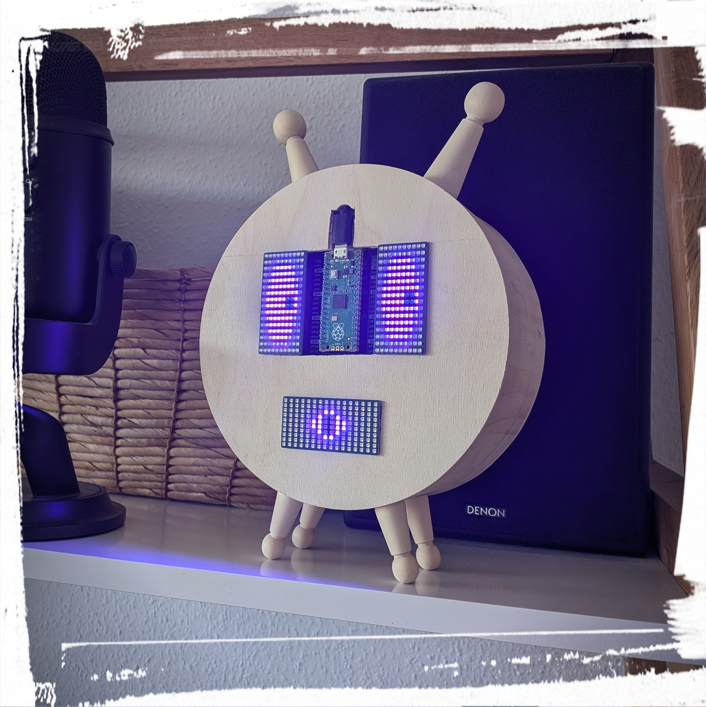
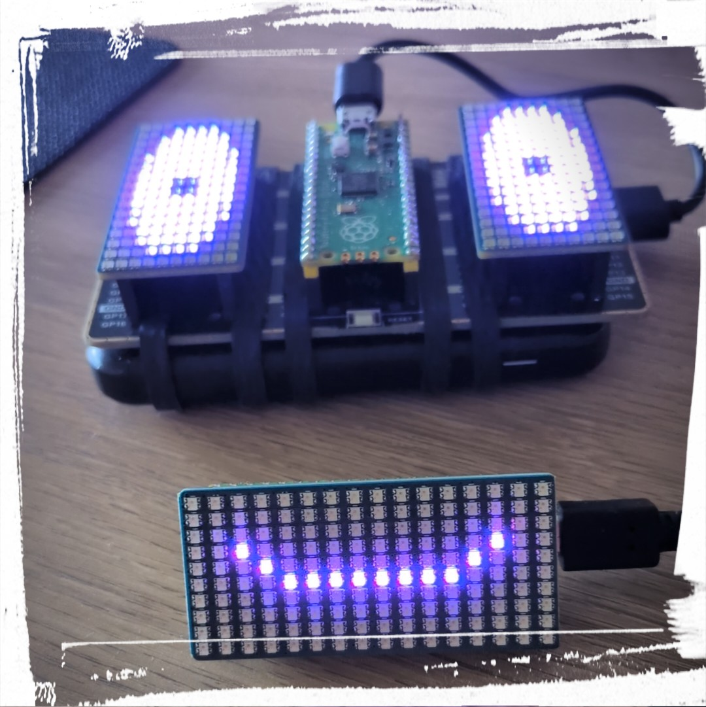

# Sprechender Holzkopf
Ein Holzkopf auf Basis des Raspberry Pi Pico 1 / 2 und Raspberry Pi Pico 2W für Speech-to-Text und Text-to-Speech Anwendungen. Es wurde für **ehrenamtliche Bildungsprojekte an allgemeinbildenden Schulen** entwickelt, um Künstliche Intelligenz für Kinder und Jugendliche greifbar und verständlich zu machen.



Das Ziel des Projekts ist nicht, einen fertigen Sprachassistenten für den Alltag bereitzustellen oder eine vollständig reproduzierbare Unterrichtslösung anzubieten. Vielmehr dient das System als Eisbrecher, um **Interesse an Informatik, Statistik und Künstlicher Intelligenz** zu wecken und Gespräche über Chancen und Grenzen moderner KI-Systeme anzuregen. Die Originalversion verwendet ein lokales Large Language Model via ```LM Studio``` inklusive einschlägigem RAG-System. Zum vereinfachten Einblick wird in dieser Dokumentation auf eine OpenAI API zurückgegriffen.

# Autor
Prof. Dr. habil. Dennis Klinkhammer

# Pädagogische Motivation
Viele Kinder kennen **Künstliche Intelligenz lediglich als abstraktes Konzept** oder aus kommerziellen Anwendungen. Dieses Projekt soll zeigen, dass KI-Systeme aus **nachvollziehbaren technischen Komponenten** bestehen und **von Menschen entwickelt** werden. Der Raspberry Pi macht die Technik sichtbar und greifbar. Dadurch entstehen natürliche Gesprächsanlässe, beispielsweise:

* Wie funktioniert Spracherkennung?
* Was passiert mit den gesprochenen Fragen?
* Können KI-Systeme Fehler machen?
* Warum sollten Menschen die Ergebnisse von KI-Systemen kritisch hinterfragen?

Das Projekt versteht sich ausdrücklich als **Demonstrator** und Gesprächsanlass, **nicht als Unterrichtsgegenstand** oder fertige Unterrichtslösung.

# Benötigte Hardware
* 2 x Raspberry Pi Pico 1 / 2
* 1 x Raspberry Pi Zero 2W
* 1 x microSD-Karte mir Raspberry Pi OS
* 1 x Waveshare GPIO Expander For Raspberry Pi Pico (SKU 20477)
* 3 x Waveshare RGB Full-color LED Matrix Panel (SKU 20170)
* 1 x BerryBase USB Mini Mikrofon (EAN: 4251266751472)
* 1 x BerryBase externer USB Mini-Lautsprecher (EAN: 6945379550159)
* sowie entspr. Powerbank(s), USB-Kabel, Micro-USB-auf-USB-A-Adapter und USB-Presenter

Je nach verwendeter Audiohardware müssen die ALSA-Geräte angepasst werden.

# Softwarevoraussetzungen
Systempakete installieren:
```
sudo apt update
sudo apt install -y python3-pip python3-venv alsa-utils ffmpeg
```
Virtuelle Umgebung erstellen:
```
python3 -m venv .venv
source .venv/bin/activate
```
Benötigte Python-Pakete installieren:
```
pip install openai python-dotenv evdev
```
Zusätzlich werden folgende Programme verwendet:

* ```arecord``` für die Audioaufnahme
* ```aplay``` für die Audioausgabe
* ```ffmpeg``` zur Umwandlung der erzeugten MP3-Dateien in WAV-Dateien

# OpenAI API konfigurieren
Im Projektverzeichnis eine Datei .env anlegen:
```
nano .env
```
Inhalt:
```
OPENAI_API_KEY=[EIGENER_API_SCHLÜSSEL]
```

# Audio-Geräte konfigurieren
Die Audio-Geräte werden im Python-Skript explizit definiert:
```
RECORDING_DEVICE = "plughw:0,0"
PLAYBACK_DEVICE = "plughw:1,0"
```
Diese Werte müssen gegebenenfalls an die verwendete Hardware angepasst werden.

Aufnahmegeräte anzeigen:
```
arecord -l
```
Wiedergabegeräte anzeigen:
```
aplay -l
```
Testaufnahme durchführen:
```
arecord -D plughw:0,0 -f cd -t wav -d 5 test.wav
```
Testwiedergabe durchführen:
```
aplay -D plughw:1,0 test.wav
```

# USB-Presenter konfigurieren
Die Eingabe erfolgt über einen USB-Presenter, der über evdev als Eingabegerät erkannt wird.

Aktuell werden folgende Tastencodes unterstützt:
```
VALID_KEYS = {
    "KEY_PAGEDOWN",
    "KEY_RIGHT",
    "KEY_ENTER",
    "KEY_SPACE",
}
```
Damit der Benutzer auf die Eingabegeräte zugreifen kann:
```
sudo usermod -aG input [BENUTZERNAME]
sudo reboot
```
Zur Analyse der erkannten Tastencodes:
```
sudo evtest
```

# Signalton konfigurieren
Vor Beginn der Aufnahme wird ein kurzer Signalton abgespielt:
```
BEEP_FILE = PROJECT_DIR / "r2d2_beep.wav"
```
Dieser signalisiert dem Nutzer den Beginn der Aufnahme.

Falls der Signalton zu laut ist, kann eine leisere Version erzeugt werden:
```
ffmpeg -y -i r2d2_beep.wav -filter:a "volume=0.35" r2d2_beep_quiet.wav
```
Anschließend den Dateinamen im Python-Skript anpassen.

# Automatischer Start beim Booten
Der Sprachassistent kann automatisch nach dem Start des Raspberry Pi ausgeführt werden.

Datei anlegen:
```
sudo nano /etc/systemd/system/voice-chatbot.service
```
Inhalt:
```
[Unit]
Description=Voice Chatbot
After=network-online.target sound.target
Wants=network-online.target

[Service]
Type=simple

User=[BENUTZERNAME]
Group=[BENUTZERNAME]

WorkingDirectory=/home/[BENUTZERNAME]/pi-voice-chatbot
EnvironmentFile=/home/[BENUTZERNAME]/pi-voice-chatbot/.env

ExecStart=/home/[BENUTZERNAME]/pi-voice-chatbot/.venv/bin/python /home/[BENUTZERNAME]/pi-voice-chatbot/voice_chatbot.py

Restart=on-failure
RestartSec=10

StandardOutput=journal
StandardError=journal

[Install]
WantedBy=multi-user.target
```
Service aktivieren:
```
sudo systemctl daemon-reload
sudo systemctl enable voice-chatbot.service
sudo systemctl start voice-chatbot.service
```
Status prüfen:
```
sudo systemctl status voice-chatbot.service
```

# Hard- und Software für das Gesicht
Die Augen und der Mund werden jeweils über ein **RGB Matrix Panel** simuliert, welches von einem **Raspberry Pi Pico 1 / 2** angesteuert wird. Dabei werden **verschiedene Mimiken simuliert**. Einfach die zur Verfügung gestellen Codes als ```main.py``` auf den Raspberry Pi Pico flashen.



# Hinweise zum Einsatz in allgemeinbildenden Schulen
Dieses Projekt verarbeitet **Spracheingaben über die OpenAI API**. Beim Einsatz mit Kindern sollten **Datenschutz, Einwilligungen und die jeweiligen schulischen Rahmenbedingungen** berücksichtigt werden.

Der Assistent ist daher **extra nicht als dauerhaft zuhörendes System konzipiert**. Die Aufnahme erfolgt **ausschließlich nach einer bewussten Aktivierung** durch den USB-Presenter. Eine lokale und datenschutzkinforme Variante ist über ein lokales Large Language Model via ```LM Studio``` möglich und erfordert einen Raspberry Pi 5 mit 16 GB Arbeitsspeicher.

**KI-Systeme können fehlerhafte oder unvollständige Antworten erzeugen**. Dies kann im Bildungskontext als Anlass genutzt werden, die Grenzen und Risiken von KI-Systemen zu diskutieren.
